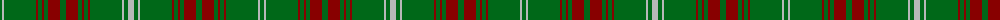

The parent of this is [Prince of Wales Fashion Weavers Tartan Tartan Number: 3306. Earliest known date: 1998 From Lochcarron. Also produced by Ingles Buchan (Textiles). same as Duke of Rothesay, Hunting. James Cant note for the Prince of Wales states, This tartan, along with the red form, was issued by the Vyella Co. It was originally meant for the Rothesay (see #1533) but the division showing the single white line was omitted by mistake. Instead of withdrawing the material, the pattern was given the name Prince of Wales. See products available Copyright © Blair Urquhart, Comrie, 2015](/tartans/g/4/n2/g32/dr2/g4/dr2/g4/dr12/g6/dr12/g4/dr2/g4/dr2/g32/n2/g4/n/6/)

This was sourced from house-of-tartan.  It is a [18 stripes tartan](/stripes/stripes18/).

Original link http://www.house-of-tartan.scotland.net/house/TartanViewjs.asp?colr=Def&tnam=3306

## Thread count
G/4 N2 G32 DR2 G4 DR2 G4 DR12 G6 DR12 G4 DR2 G4 DR2 G32 N2 G4 N/6

## Palette
Each colour and its ΔE from the base-6 reference it is a variant of.

| Colour | Shade | Base | ΔE (OKLab) |
|---|---|---|---|
| DR |  `#880000` | R  | 0.14 |
| G |  `#006818` | G  | 0.02 |
| N |  `#B8B8B8` | Y  | 0.17 |

ID: /variants/g/4/n2/g32/dr2/g4/dr2/g4/dr12/g6/dr12/g4/dr2/g4/dr2/g32/n2/g4/n/6-dr880000-g006818-nb8b8b8/
