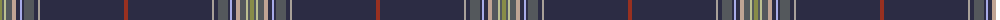

The parent of this is [Registers of Scotland, The (Corp)](/tartans/g/4/n2/na2/n6/nc4/db4/lp2/db2/n10/db4/nb2/db84/t/4/)

This was sourced from tartans-authority.  It is a [13 stripes tartan](/stripes/stripes13/).

Original link http://www.tartansauthority.com/tartan-ferret/display/7830/

## Thread count
G/4 N2 Na2 N6 Nc4 DB4 LP2 DB2 N10 DB4 Nb2 DB84 T/4

## Palette
Each colour and its ΔE from the base-6 reference it is a variant of.

| Colour | Shade | Base | ΔE (OKLab) |
|---|---|---|---|
| DB |  `#2C2C44` | B  | 0.12 |
| G |  `#888C48` | G  | 0.20 |
| LP |  `#A8ACE8` | W  | 0.22 |
| N |  `#54585C` | B  | 0.13 |
| Na |  `#BCC090` | Y  | 0.11 |
| Nb |  `#A8A098` | Y  | 0.19 |
| Nc |  `#C0A494` | Y  | 0.16 |
| T |  `#983020` | R  | 0.09 |

ID: /variants/g/4/n2/na2/n6/nc4/db4/lp2/db2/n10/db4/nb2/db84/t/4-db2c2c44-g888c48-lpa8ace8-n54585c-nabcc090-nba8a098-ncc0a494-t983020/
