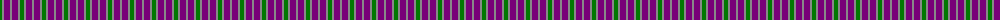
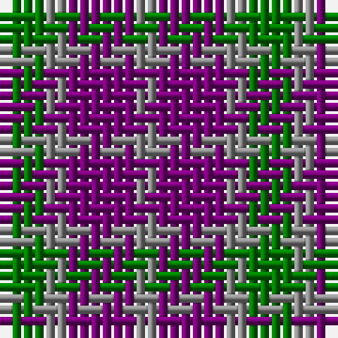

The parent of this is [Coleman, Sarah-Louise (Personal)](/tartans/g/4/n2/p6/n/2/)

This was sourced from register-of-tartans.  It is a [4 stripes tartan](/stripes/stripes4/).

Original link https://www.tartanregister.gov.uk/tartanDetails.aspx?ref=11027

## Thread count
G/4 N2 P6 N/2

## Palette
Each colour and its ΔE from the base-6 reference it is a variant of.

| Colour | Shade | Base | ΔE (OKLab) |
|---|---|---|---|
| G |  `#007800` | G  | 0.06 |
| N |  `#888888` | R  | 0.24 |
| P |  `#780078` | B  | 0.16 |

# Sample pattern

ID: /variants/g/4/n2/p6/n/2-g007800-n888888-p780078/
