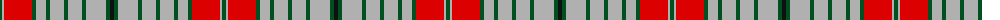

The parent of this is [Glenaffric Fragment](/tartans/g/4/n2/r28/g4/n10/g4/n14/g4/n14/g4/n20/g4/k/4/)

This was sourced from register-of-tartans.  It is a [13 stripes tartan](/stripes/stripes13/).

Original link https://www.tartanregister.gov.uk/tartanDetails.aspx?ref=1402

## Thread count
G/4 N2 R28 G4 N10 G4 N14 G4 N14 G4 N20 G4 K/4

## Palette
Each colour and its ΔE from the base-6 reference it is a variant of.

| Colour | Shade | Base | ΔE (OKLab) |
|---|---|---|---|
| G |  `#005020` | G  | 0.08 |
| K |  `#101010` | K  | 0.17 |
| N |  `#B0B0B0` | Y  | 0.18 |
| R |  `#DC0000` | R  | 0.04 |

ID: /variants/g/4/n2/r28/g4/n10/g4/n14/g4/n14/g4/n20/g4/k/4-g005020-k101010-nb0b0b0-rdc0000/
