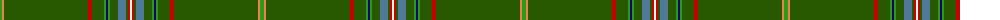

The parent of this is [Kerr of Ardgowan Hunting (Personal)](/tartans/g/4/o2/ga84/r4/ga12/g2/db2/g2/ga8/b8/ga2/r2/w/2/)

This was sourced from tartans-authority.  It is a [13 stripes tartan](/stripes/stripes13/).

Original link http://www.tartansauthority.com/tartan-ferret/display/7319/

## Thread count
G/4 O2 Ga84 R4 Ga12 G2 DB2 G2 Ga8 B8 Ga2 R2 W/2

## Palette
Each colour and its ΔE from the base-6 reference it is a variant of.

| Colour | Shade | Base | ΔE (OKLab) |
|---|---|---|---|
| B |  `#507898` | B  | 0.17 |
| DB |  `#1C0070` | B  | 0.14 |
| G |  `#289C18` | G  | 0.18 |
| Ga |  `#285800` | G  | 0.04 |
| O |  `#EC8048` | Y  | 0.17 |
| R |  `#C80000` | R  | 0.00 |
| W |  `#FCFCEC` | W  | 0.03 |

ID: /variants/g/4/o2/ga84/r4/ga12/g2/db2/g2/ga8/b8/ga2/r2/w/2-b507898-db1c0070-g289c18-ga285800-oec8048-rc80000-wfcfcec/
