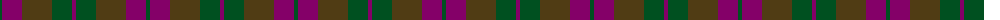
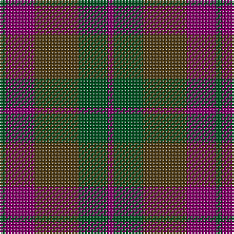

The parent of this is [Harmony 6](/tartans/g/4/p20/t30/g20/p/4/)

This was sourced from register-of-tartans.  It is a [5 stripes tartan](/stripes/stripes5/).

Original link https://www.tartanregister.gov.uk/tartanDetails.aspx?ref=1611

## Thread count
G/4 P20 T30 G20 P/4

## Palette
Each colour and its ΔE from the base-6 reference it is a variant of.

| Colour | Shade | Base | ΔE (OKLab) |
|---|---|---|---|
| G |  `#005020` | G  | 0.08 |
| P |  `#840068` | B  | 0.18 |
| T |  `#503C14` | G  | 0.15 |

# Sample pattern

ID: /variants/g/4/p20/t30/g20/p/4-g005020-p840068-t503c14/
