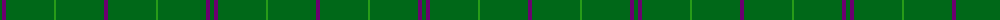

The parent of this is [Walters (Personal)](/tartans/g/4/p4/g40/g4/g4/ga2/g4/g4/g40/p/4/)

This was sourced from register-of-tartans.  It is a [10 stripes tartan](/stripes/stripes10/).

Original link https://www.tartanregister.gov.uk/tartanDetails.aspx?ref=4489

## Thread count
G/4 P4 G40 G4 G4 Ga2 G4 G4 G40 P/4

## Palette
Each colour and its ΔE from the base-6 reference it is a variant of.

| Colour | Shade | Base | ΔE (OKLab) |
|---|---|---|---|
| G |  `#006818` | G  | 0.02 |
| Ga |  `#289C18` | G  | 0.18 |
| P |  `#6C0070` | B  | 0.15 |

ID: /variants/g/4/p4/g40/g4/g4/ga2/g4/g4/g40/p/4-g006818-ga289c18-p6c0070/
