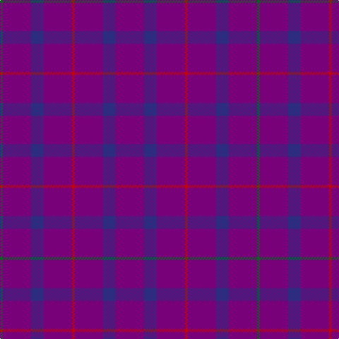

The parent of this is [Scottish Netball Association (1987)](/tartans/g/4/p40/db18/p40/r4/p40/db18/p/40/)

This was sourced from register-of-tartans.  It is a [8 stripes tartan](/stripes/stripes8/).

Original link https://www.tartanregister.gov.uk/tartanDetails.aspx?ref=3734

## Thread count
G/4 P40 DB18 P40 R4 P40 DB18 P/40

## Palette
Each colour and its ΔE from the base-6 reference it is a variant of.

| Colour | Shade | Base | ΔE (OKLab) |
|---|---|---|---|
| DB |  `#2C2C80` | B  | 0.05 |
| G |  `#006818` | G  | 0.02 |
| P |  `#780078` | B  | 0.16 |
| R |  `#C80000` | R  | 0.00 |

# Sample pattern

ID: /variants/g/4/p40/db18/p40/r4/p40/db18/p/40-db2c2c80-g006818-p780078-rc80000/
