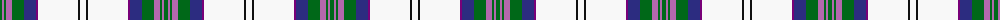

The parent of this is [Scotland the Brave Dress (Dance)](/tartans/g/4/pa2/g2/pa6/g12/db12/p2/w40/k2/w/6/)

This was sourced from tartans-authority.  It is a [10 stripes tartan](/stripes/stripes10/).

Original link http://www.tartansauthority.com/tartan-ferret/display/6567/

## Thread count
G/4 Pa2 G2 Pa6 G12 DB12 P2 W40 K2 W/6

## Palette
Each colour and its ΔE from the base-6 reference it is a variant of.

| Colour | Shade | Base | ΔE (OKLab) |
|---|---|---|---|
| DB |  `#2C2C80` | B  | 0.05 |
| G |  `#006818` | G  | 0.02 |
| K |  `#101010` | K  | 0.17 |
| P |  `#780078` | B  | 0.16 |
| Pa |  `#B468AC` | R  | 0.21 |
| W |  `#F8F8F8` | W  | 0.01 |

ID: /variants/g/4/pa2/g2/pa6/g12/db12/p2/w40/k2/w/6-db2c2c80-g006818-k101010-p780078-pab468ac-wf8f8f8/
