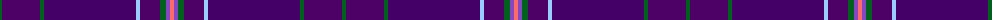

The parent of this is [Spirit of Hoxa](/tartans/g/4/pa38/g4/dp92/lb4/pa20/g6/p4/lr/4/)

This was sourced from register-of-tartans.  It is a [9 stripes tartan](/stripes/stripes9/).

Original link https://www.tartanregister.gov.uk/tartanDetails.aspx?ref=10705

## Thread count
G/4 Pa38 G4 DP92 LB4 Pa20 G6 P4 LR/4

## Palette
Each colour and its ΔE from the base-6 reference it is a variant of.

| Colour | Shade | Base | ΔE (OKLab) |
|---|---|---|---|
| DP |  `#440066` | B  | 0.14 |
| G |  `#00611C` | G  | 0.02 |
| LB |  `#99CCFF` | W  | 0.17 |
| LR |  `#FF6A6A` | R  | 0.19 |
| P |  `#8547C2` | B  | 0.18 |
| Pa |  `#4D0066` | B  | 0.14 |

ID: /variants/g/4/pa38/g4/dp92/lb4/pa20/g6/p4/lr/4-dp440066-g00611c-lb99ccff-lrff6a6a-p8547c2-pa4d0066/
