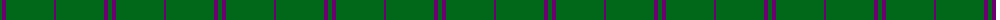
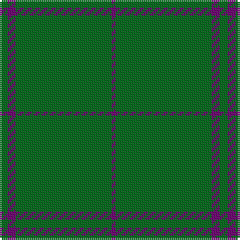

The parent of this is [Walters (Personal)](/tartans/g/4/pa4/g40/g4/g4/p/2/)

This was sourced from tartans-authority.  It is a [6 stripes tartan](/stripes/stripes6/).

Original link http://www.tartansauthority.com/tartan-ferret/display/4160/

## Thread count
G/4 Pa4 G40 G4 G4 P/2

## Palette
Each colour and its ΔE from the base-6 reference it is a variant of.

| Colour | Shade | Base | ΔE (OKLab) |
|---|---|---|---|
| G |  `#006818` | G  | 0.02 |
| P |  `#6C0070` | B  | 0.15 |
| Pa |  `#6C0070` | B  | 0.15 |

# Sample pattern

ID: /variants/g/4/pa4/g40/g4/g4/p/2-g006818-p6c0070-pa6c0070/
