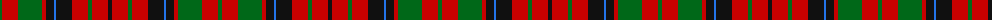

The parent of this is [MacNicol Dress (Clan) (Smiths)](/tartans/g/4/r16/g24/r4/k8/b2/k16/r16/g4/r16/k/4/)

This was sourced from tartans-authority.  It is a [11 stripes tartan](/stripes/stripes11/).

Original link http://www.tartansauthority.com/tartan-ferret/display/871/

## Thread count
G/4 R16 G24 R4 K8 B2 K16 R16 G4 R16 K/4

## Palette
Each colour and its ΔE from the base-6 reference it is a variant of.

| Colour | Shade | Base | ΔE (OKLab) |
|---|---|---|---|
| B |  `#2474E8` | B  | 0.20 |
| G |  `#006818` | G  | 0.02 |
| K |  `#101010` | K  | 0.17 |
| R |  `#C80000` | R  | 0.00 |

ID: /variants/g/4/r16/g24/r4/k8/b2/k16/r16/g4/r16/k/4-b2474e8-g006818-k101010-rc80000/
