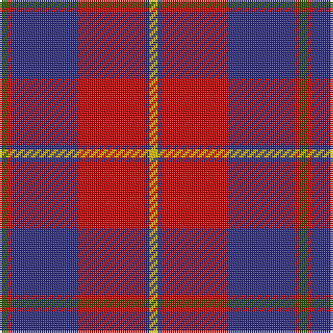

The parent of this is [Galloway Dress (Yellow Line) (Dist)](/tartans/g/4/r2/db32/r32/db2/y/4/)

This was sourced from tartans-authority.  It is a [6 stripes tartan](/stripes/stripes6/).

Original link http://www.tartansauthority.com/tartan-ferret/display/850/

## Thread count
G/4 R2 DB32 R32 DB2 Y/4

## Palette
Each colour and its ΔE from the base-6 reference it is a variant of.

| Colour | Shade | Base | ΔE (OKLab) |
|---|---|---|---|
| DB |  `#2C2C80` | B  | 0.05 |
| G |  `#285800` | G  | 0.04 |
| R |  `#C80000` | R  | 0.00 |
| Y |  `#E8C000` | Y  | 0.00 |

# Sample pattern

ID: /variants/g/4/r2/db32/r32/db2/y/4-db2c2c80-g285800-rc80000-ye8c000/
