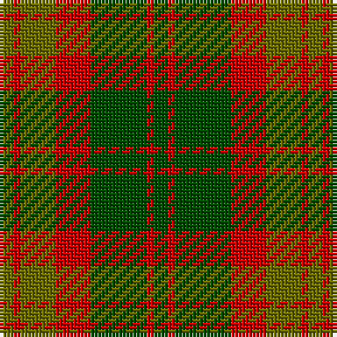

The parent of this is [Glen Esk (Fashion)](/tartans/g/4/r2/g10/r10/ga16/r2/ga/4/)

This was sourced from tartans-authority.  It is a [7 stripes tartan](/stripes/stripes7/).

Original link http://www.tartansauthority.com/tartan-ferret/display/5007/

## Thread count
G/4 R2 G10 R10 Ga16 R2 Ga/4

## Palette
Each colour and its ΔE from the base-6 reference it is a variant of.

| Colour | Shade | Base | ΔE (OKLab) |
|---|---|---|---|
| G |  `#6C6C00` | G  | 0.11 |
| Ga |  `#004C00` | G  | 0.08 |
| R |  `#C80000` | R  | 0.00 |

# Sample pattern

ID: /variants/g/4/r2/g10/r10/ga16/r2/ga/4-g6c6c00-ga004c00-rc80000/
