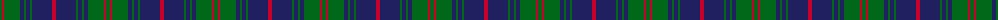

The parent of this is [Brown, Barnaby (Personal)](/tartans/g/4/r2/g16/db4/g2/db4/g2/db20/r/4/)

This was sourced from tartans-authority.  It is a [9 stripes tartan](/stripes/stripes9/).

Original link http://www.tartansauthority.com/tartan-ferret/display/2683/

## Thread count
G/4 R2 G16 DB4 G2 DB4 G2 DB20 R/4

## Palette
Each colour and its ΔE from the base-6 reference it is a variant of.

| Colour | Shade | Base | ΔE (OKLab) |
|---|---|---|---|
| DB |  `#202060` | B  | 0.11 |
| G |  `#006818` | G  | 0.02 |
| R |  `#C8002C` | R  | 0.03 |

ID: /variants/g/4/r2/g16/db4/g2/db4/g2/db20/r/4-db202060-g006818-rc8002c/
