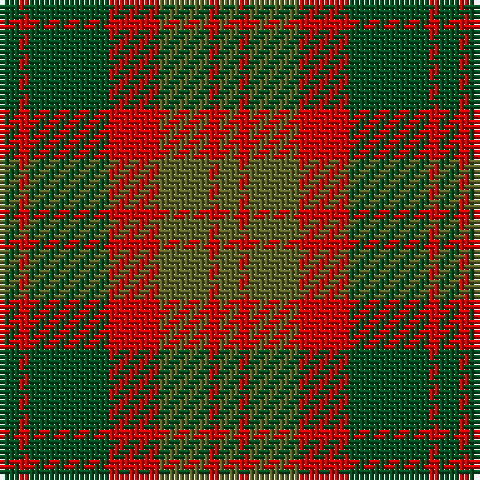

The parent of this is [Glen Esk (1993)](/tartans/g/4/r2/g16/r10/ga10/r2/ga/4/)

This was sourced from register-of-tartans.  It is a [7 stripes tartan](/stripes/stripes7/).

Original link https://www.tartanregister.gov.uk/tartanDetails.aspx?ref=1377

## Thread count
G/4 R2 G16 R10 Ga10 R2 Ga/4

## Palette
Each colour and its ΔE from the base-6 reference it is a variant of.

| Colour | Shade | Base | ΔE (OKLab) |
|---|---|---|---|
| G |  `#005020` | G  | 0.08 |
| Ga |  `#5C6428` | G  | 0.09 |
| R |  `#DC0000` | R  | 0.04 |

# Sample pattern

ID: /variants/g/4/r2/g16/r10/ga10/r2/ga/4-g005020-ga5c6428-rdc0000/
