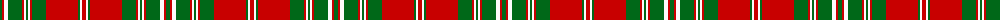

The parent of this is [Mordente (Personal)](/tartans/g/4/r2/w4/g14/r2/w2/g2/w2/r2/g14/r32/g2/w2/r/4/)

This was sourced from tartans-authority.  It is a [14 stripes tartan](/stripes/stripes14/).

Original link http://www.tartansauthority.com/tartan-ferret/display/1016/

## Thread count
G/4 R2 W4 G14 R2 W2 G2 W2 R2 G14 R32 G2 W2 R/4

## Palette
Each colour and its ΔE from the base-6 reference it is a variant of.

| Colour | Shade | Base | ΔE (OKLab) |
|---|---|---|---|
| G |  `#006818` | G  | 0.02 |
| R |  `#C80000` | R  | 0.00 |
| W |  `#FCFCFC` | W  | 0.03 |

ID: /variants/g/4/r2/w4/g14/r2/w2/g2/w2/r2/g14/r32/g2/w2/r/4-g006818-rc80000-wfcfcfc/
