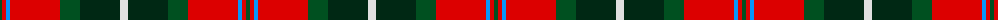

The parent of this is [Caledonian Brewery (Corporate)](/tartans/g/4/r4/b4/r50/g20/dg40/ln/8/)

This was sourced from register-of-tartans.  It is a [7 stripes tartan](/stripes/stripes7/).

Original link https://www.tartanregister.gov.uk/tartanDetails.aspx?ref=471

## Thread count
G/4 R4 B4 R50 G20 DG40 LN/8

## Palette
Each colour and its ΔE from the base-6 reference it is a variant of.

| Colour | Shade | Base | ΔE (OKLab) |
|---|---|---|---|
| B |  `#0596FA` | B  | 0.28 |
| DG |  `#002814` | B  | 0.21 |
| G |  `#005020` | G  | 0.08 |
| LN |  `#E0E0E0` | W  | 0.06 |
| R |  `#DC0000` | R  | 0.04 |

# Sample pattern

ID: /variants/g/4/r4/b4/r50/g20/dg40/ln/8-b0596fa-dg002814-g005020-lne0e0e0-rdc0000/
