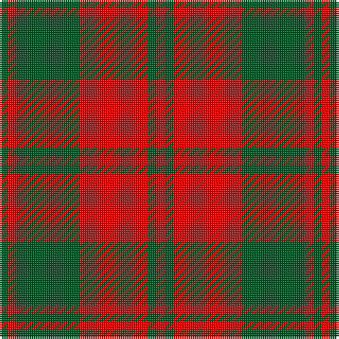

The parent of this is [Unidentified NW Highlands](/tartans/g/4/r4/g30/r32/g4/r/4/)

This was sourced from register-of-tartans.  It is a [6 stripes tartan](/stripes/stripes6/).

Original link https://www.tartanregister.gov.uk/tartanDetails.aspx?ref=4335

## Thread count
G/4 R4 G30 R32 G4 R/4

## Palette
Each colour and its ΔE from the base-6 reference it is a variant of.

| Colour | Shade | Base | ΔE (OKLab) |
|---|---|---|---|
| G |  `#005020` | G  | 0.08 |
| R |  `#DC0000` | R  | 0.04 |

# Sample pattern

ID: /variants/g/4/r4/g30/r32/g4/r/4-g005020-rdc0000/
