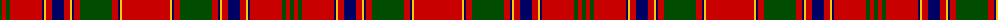

The parent of this is [Munro](/tartans/g/4/r4/g4/r32/db2/y2/r6/db12/r6/y2/db2/r6/g32/r6/db2/y2/r/48/)

This was sourced from weddslist.  It is a [17 stripes tartan](/stripes/stripes17/).

Original link http://www.weddslist.com/cgi-bin/tartans/pg.pl?source=rb

## Thread count
G/4 R4 G4 R32 DB2 Y2 R6 DB12 R6 Y2 DB2 R6 G32 R6 DB2 Y2 R/48

## Palette
Each colour and its ΔE from the base-6 reference it is a variant of.

| Colour | Shade | Base | ΔE (OKLab) |
|---|---|---|---|
| DB |  `#000064` | B  | 0.17 |
| G |  `#004C00` | G  | 0.08 |
| R |  `#C80000` | R  | 0.00 |
| Y |  `#FFC800` | Y  | 0.04 |

ID: /variants/g/4/r4/g4/r32/db2/y2/r6/db12/r6/y2/db2/r6/g32/r6/db2/y2/r/48-db000064-g004c00-rc80000-yffc800/
