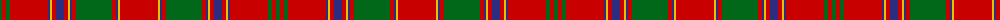

The parent of this is [Munro (Logan)](/tartans/g/4/r4/g4/r38/db2/y2/r4/db8/r4/y2/db2/r4/g36/r4/db2/y2/r/38/)

This was sourced from register-of-tartans.  It is a [17 stripes tartan](/stripes/stripes17/).

Original link https://www.tartanregister.gov.uk/tartanDetails.aspx?ref=3051

## Thread count
G/4 R4 G4 R38 DB2 Y2 R4 DB8 R4 Y2 DB2 R4 G36 R4 DB2 Y2 R/38

## Palette
Each colour and its ΔE from the base-6 reference it is a variant of.

| Colour | Shade | Base | ΔE (OKLab) |
|---|---|---|---|
| DB |  `#2C2C80` | B  | 0.05 |
| G |  `#006818` | G  | 0.02 |
| R |  `#C80000` | R  | 0.00 |
| Y |  `#E8C000` | Y  | 0.00 |

ID: /variants/g/4/r4/g4/r38/db2/y2/r4/db8/r4/y2/db2/r4/g36/r4/db2/y2/r/38-db2c2c80-g006818-rc80000-ye8c000/
