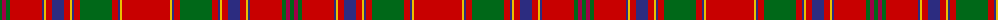

The parent of this is [Munro Clan Tartan Tartan Number: 974. Earliest known date: 1810-15 This sett is usually regarded as the correct form of the Munro tartan. It is illustrated by Smibert and the Smith brothers (both works published in 1850). In early versions bright pink replaces the crimson between the three green lines. Munros wear the 'Black Watch' as a Hunting tartan. See products available Copyright © Blair Urquhart, Comrie, 2015](/tartans/g/4/r4/g4/ra32/db2/y2/ra6/db12/ra6/y2/db2/ra6/g32/ra6/db2/y2/ra/48/)

This was sourced from house-of-tartan.  It is a [17 stripes tartan](/stripes/stripes17/).

Original link http://www.house-of-tartan.scotland.net/house/TartanViewjs.asp?colr=Def&tnam=974

## Thread count
G/4 R4 G4 Ra32 DB2 Y2 Ra6 DB12 Ra6 Y2 DB2 Ra6 G32 Ra6 DB2 Y2 Ra/48

## Palette
Each colour and its ΔE from the base-6 reference it is a variant of.

| Colour | Shade | Base | ΔE (OKLab) |
|---|---|---|---|
| DB |  `#2C2C80` | B  | 0.05 |
| G |  `#006818` | G  | 0.02 |
| R |  `#A00048` | R  | 0.11 |
| Ra |  `#C80000` | R  | 0.00 |
| Y |  `#E8C000` | Y  | 0.00 |

ID: /variants/g/4/r4/g4/ra32/db2/y2/ra6/db12/ra6/y2/db2/ra6/g32/ra6/db2/y2/ra/48-db2c2c80-g006818-ra00048-rac80000-ye8c000/
