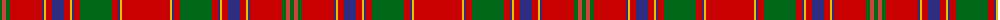

The parent of this is [Munro](/tartans/g/4/r4/g4/ra32/db2/y2/ra6/db12/ra6/y2/db2/ra6/g32/ra6/db2/y2/ra/48/)

This was sourced from register-of-tartans.  It is a [17 stripes tartan](/stripes/stripes17/).

Original link https://www.tartanregister.gov.uk/tartanDetails.aspx?ref=3048

## Thread count
G/4 R4 G4 Ra32 DB2 Y2 Ra6 DB12 Ra6 Y2 DB2 Ra6 G32 Ra6 DB2 Y2 Ra/48

## Palette
Each colour and its ΔE from the base-6 reference it is a variant of.

| Colour | Shade | Base | ΔE (OKLab) |
|---|---|---|---|
| DB |  `#2C2C80` | B  | 0.05 |
| G |  `#006818` | G  | 0.02 |
| R |  `#CC4438` | R  | 0.07 |
| Ra |  `#C80000` | R  | 0.00 |
| Y |  `#E8C000` | Y  | 0.00 |

ID: /variants/g/4/r4/g4/ra32/db2/y2/ra6/db12/ra6/y2/db2/ra6/g32/ra6/db2/y2/ra/48-db2c2c80-g006818-rcc4438-rac80000-ye8c000/
