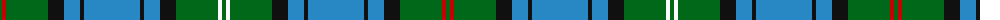

The parent of this is [Mack (Name)](/tartans/g/4/r4/g42/k16/b16/k4/b56/k4/b16/k16/g42/w4/g/4/)

This was sourced from tartans-authority.  It is a [13 stripes tartan](/stripes/stripes13/).

Original link http://www.tartansauthority.com/tartan-ferret/display/6209/

## Thread count
G/4 R4 G42 K16 B16 K4 B56 K4 B16 K16 G42 W4 G/4

## Palette
Each colour and its ΔE from the base-6 reference it is a variant of.

| Colour | Shade | Base | ΔE (OKLab) |
|---|---|---|---|
| B |  `#2888C4` | B  | 0.21 |
| G |  `#006818` | G  | 0.02 |
| K |  `#101010` | K  | 0.17 |
| R |  `#C80000` | R  | 0.00 |
| W |  `#FCFCFC` | W  | 0.03 |

ID: /variants/g/4/r4/g42/k16/b16/k4/b56/k4/b16/k16/g42/w4/g/4-b2888c4-g006818-k101010-rc80000-wfcfcfc/
