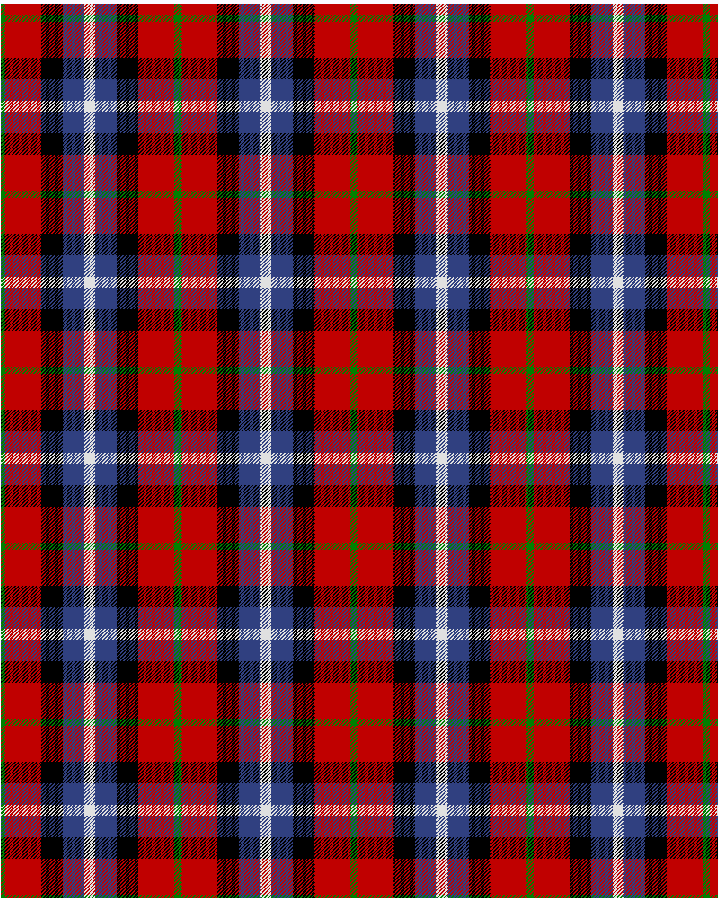

Baillie of Polkemett

This was sourced from <no value>.  It is a 5 stripes tartan.

Original link http://www.weddslist.com/cgi-bin/tartans/pg.pl?source=sts

## Thread count
G/4 R40 K24 B24 LN/6

## Palette
B#304080 G#008000 K#000000 LN#E0E0E0 R#C00000

# Sample pattern

ID: /variants/g/4/r40/k24/b24/ln/6-b304080-g008000-k000000-lne0e0e0-rc00000