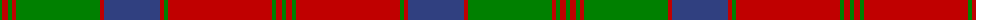

The parent of this is [MacQuarrie 3](/tartans/g/4/r6/g4/r4/g84/r4/b56/r4/g4/r104/g4/r6/g/4/)

This was sourced from weddslist.  It is a [13 stripes tartan](/stripes/stripes13/).

Original link http://www.weddslist.com/cgi-bin/tartans/pg.pl?source=sts

## Thread count
G/4 R6 G4 R4 G84 R4 B56 R4 G4 R104 G4 R6 G/4

## Palette
Each colour and its ΔE from the base-6 reference it is a variant of.

| Colour | Shade | Base | ΔE (OKLab) |
|---|---|---|---|
| B |  `#304080` | B  | 0.01 |
| G |  `#008000` | G  | 0.09 |
| R |  `#C00000` | R  | 0.02 |

ID: /variants/g/4/r6/g4/r4/g84/r4/b56/r4/g4/r104/g4/r6/g/4-b304080-g008000-rc00000/
