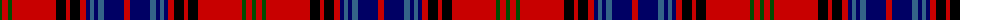

The parent of this is [Lochcarron Dress (Corporate)](/tartans/g/4/r6/g4/r44/k10/r4/k10/r6/db4/b4/db4/b6/db20/r/6/)

This was sourced from tartans-authority.  It is a [14 stripes tartan](/stripes/stripes14/).

Original link http://www.tartansauthority.com/tartan-ferret/display/5463/

## Thread count
G/4 R6 G4 R44 K10 R4 K10 R6 DB4 B4 DB4 B6 DB20 R/6

## Palette
Each colour and its ΔE from the base-6 reference it is a variant of.

| Colour | Shade | Base | ΔE (OKLab) |
|---|---|---|---|
| B |  `#346488` | B  | 0.11 |
| DB |  `#000064` | B  | 0.17 |
| G |  `#004C00` | G  | 0.08 |
| K |  `#000000` | K  | 0.00 |
| R |  `#C80000` | R  | 0.00 |

ID: /variants/g/4/r6/g4/r44/k10/r4/k10/r6/db4/b4/db4/b6/db20/r/6-b346488-db000064-g004c00-k000000-rc80000/
