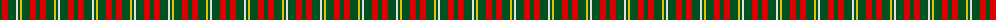

The parent of this is [Unidentified #33](/tartans/g/4/r6/g8/ln2/g2/y2/g8/r6/g/4/)

This was sourced from register-of-tartans.  It is a [9 stripes tartan](/stripes/stripes9/).

Original link https://www.tartanregister.gov.uk/tartanDetails.aspx?ref=4234

## Thread count
G/4 R6 G8 LN2 G2 Y2 G8 R6 G/4

## Palette
Each colour and its ΔE from the base-6 reference it is a variant of.

| Colour | Shade | Base | ΔE (OKLab) |
|---|---|---|---|
| G |  `#005020` | G  | 0.08 |
| LN |  `#E0E0E0` | W  | 0.06 |
| R |  `#DC0000` | R  | 0.04 |
| Y |  `#E8C000` | Y  | 0.00 |

ID: /variants/g/4/r6/g8/ln2/g2/y2/g8/r6/g/4-g005020-lne0e0e0-rdc0000-ye8c000/
