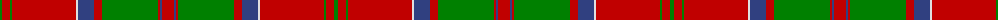

The parent of this is [MacDonell of Keppoch](/tartans/g/4/r8/g2/r64/ln2/b16/r8/g56/r2/b2/r/12/)

This was sourced from weddslist.  It is a [11 stripes tartan](/stripes/stripes11/).

Original link http://www.weddslist.com/cgi-bin/tartans/pg.pl?source=sts

## Thread count
G/4 R8 G2 R64 LN2 B16 R8 G56 R2 B2 R/12

## Palette
Each colour and its ΔE from the base-6 reference it is a variant of.

| Colour | Shade | Base | ΔE (OKLab) |
|---|---|---|---|
| B |  `#304080` | B  | 0.01 |
| G |  `#008000` | G  | 0.09 |
| LN |  `#E0E0E0` | W  | 0.06 |
| R |  `#C00000` | R  | 0.02 |

ID: /variants/g/4/r8/g2/r64/ln2/b16/r8/g56/r2/b2/r/12-b304080-g008000-lne0e0e0-rc00000/
