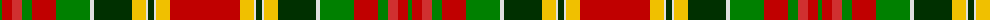

The parent of this is [Unidentified 9](/tartans/g/4/ra10/r10/g10/ra24/g34/ln4/dg38/y14/ln2/dg6/ln2/y14/ra/70/)

This was sourced from weddslist.  It is a [14 stripes tartan](/stripes/stripes14/).

Original link http://www.weddslist.com/cgi-bin/tartans/pg.pl?source=sts

## Thread count
G/4 Ra10 R10 G10 Ra24 G34 LN4 DG38 Y14 LN2 DG6 LN2 Y14 Ra/70

## Palette
Each colour and its ΔE from the base-6 reference it is a variant of.

| Colour | Shade | Base | ΔE (OKLab) |
|---|---|---|---|
| DG |  `#003000` | G  | 0.18 |
| G |  `#008000` | G  | 0.09 |
| LN |  `#E0E0E0` | W  | 0.06 |
| R |  `#D03030` | R  | 0.05 |
| Ra |  `#C00000` | R  | 0.02 |
| Y |  `#F0C000` | Y  | 0.01 |

ID: /variants/g/4/ra10/r10/g10/ra24/g34/ln4/dg38/y14/ln2/dg6/ln2/y14/ra/70-dg003000-g008000-lne0e0e0-rd03030-rac00000-yf0c000/
