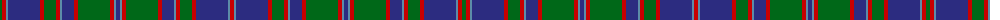

The parent of this is [Norwich No.023](/tartans/g/4/ra4/b2/dba32/ra4/g12/ra4/b2/dba12/ra4/g32/ra4/b2/dba4/b2/ra4/g32/ra4/dba12/b2/ra4/g12/ra4/dba32/b2/ra/4/)

This was sourced from register-of-tartans.  It is a [26 stripes tartan](/stripes/stripes26/).

Original link https://www.tartanregister.gov.uk/tartanDetails.aspx?ref=3175

## Thread count
G/4 Ra4 B2 DBa32 Ra4 G12 Ra4 B2 DBa12 Ra4 G32 Ra4 B2 DBa4 B2 Ra4 G32 Ra4 DBa12 B2 Ra4 G12 Ra4 DBa32 B2 Ra/4

## Palette
Each colour and its ΔE from the base-6 reference it is a variant of.

| Colour | Shade | Base | ΔE (OKLab) |
|---|---|---|---|
| B |  `#5C8CA8` | B  | 0.23 |
| DB |  `#000048` | B  | 0.21 |
| DBa |  `#2C2C80` | B  | 0.05 |
| DG |  `#004028` | G  | 0.14 |
| G |  `#006818` | G  | 0.02 |
| LB |  `#00FCFC` | W  | 0.17 |
| R |  `#C80000` | R  | 0.00 |
| Ra |  `#C80000` | R  | 0.00 |

ID: /variants/g/4/ra4/b2/dba32/ra4/g12/ra4/b2/dba12/ra4/g32/ra4/b2/dba4/b2/ra4/g32/ra4/dba12/b2/ra4/g12/ra4/dba32/b2/ra/4-b5c8ca8-db000048-dba2c2c80-dg004028-g006818-lb00fcfc-rc80000-rac80000/
