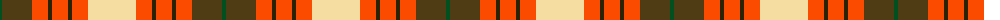

The parent of this is [Unidentified from Winnipeg](/tartans/g/4/t30/r16/k4/r16/k4/r16/ly/48/)

This was sourced from register-of-tartans.  It is a [8 stripes tartan](/stripes/stripes8/).

Original link https://www.tartanregister.gov.uk/tartanDetails.aspx?ref=4297

## Thread count
G/4 T30 R16 K4 R16 K4 R16 LY/48

## Palette
Each colour and its ΔE from the base-6 reference it is a variant of.

| Colour | Shade | Base | ΔE (OKLab) |
|---|---|---|---|
| G |  `#005020` | G  | 0.08 |
| K |  `#2A2303` | B  | 0.21 |
| LY |  `#F5DCA0` | W  | 0.10 |
| R |  `#FA4B00` | R  | 0.14 |
| T |  `#503C14` | G  | 0.15 |

# Sample pattern

ID: /variants/g/4/t30/r16/k4/r16/k4/r16/ly/48-g005020-k2a2303-lyf5dca0-rfa4b00-t503c14/
