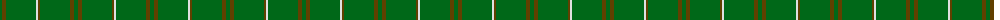

The parent of this is [Bannockbane Hunting Trade Tartan Tartan Number: 909. Earliest known date: c.1984 Nothing See products available Copyright © Blair Urquhart, Comrie, 2015](/tartans/g/4/t4/g30/ln2/t2/g30/t4/g/4/)

This was sourced from house-of-tartan.  It is a [8 stripes tartan](/stripes/stripes8/).

Original link http://www.house-of-tartan.scotland.net/house/TartanViewjs.asp?colr=Def&tnam=909

## Thread count
G/4 T4 G30 LN2 T2 G30 T4 G/4

## Palette
Each colour and its ΔE from the base-6 reference it is a variant of.

| Colour | Shade | Base | ΔE (OKLab) |
|---|---|---|---|
| G |  `#006818` | G  | 0.02 |
| LN |  `#E0E0E0` | W  | 0.06 |
| T |  `#604000` | G  | 0.14 |

# Sample pattern

ID: /variants/g/4/t4/g30/ln2/t2/g30/t4/g/4-g006818-lne0e0e0-t604000/
