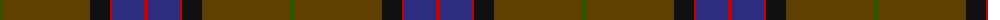
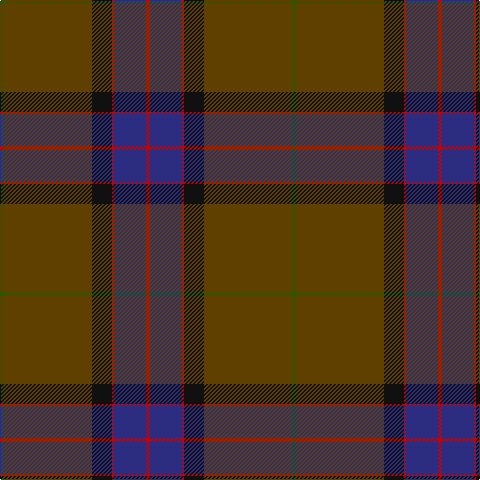

The parent of this is [MacWilliam Htg](/tartans/g/4/t64/t24/k20/r2/db32/r/4/)

This was sourced from tartans-authority.  It is a [7 stripes tartan](/stripes/stripes7/).

Original link http://www.tartansauthority.com/tartan-ferret/display/1417/

## Thread count
G/4 T64 T24 K20 R2 DB32 R/4

## Palette
Each colour and its ΔE from the base-6 reference it is a variant of.

| Colour | Shade | Base | ΔE (OKLab) |
|---|---|---|---|
| DB |  `#2C2C80` | B  | 0.05 |
| G |  `#285800` | G  | 0.04 |
| K |  `#101010` | K  | 0.17 |
| R |  `#C80000` | R  | 0.00 |
| T |  `#604000` | G  | 0.14 |

# Sample pattern

ID: /variants/g/4/t64/t24/k20/r2/db32/r/4-db2c2c80-g285800-k101010-rc80000-t604000/
