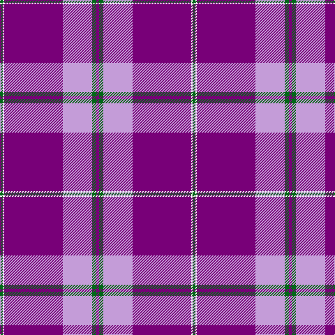

The parent of this is [SiMBA](/tartans/g/4/w2/p84/lp42/g6/p/4/)

This was sourced from tartans-authority.  It is a [6 stripes tartan](/stripes/stripes6/).

Original link http://www.tartansauthority.com/tartan-ferret/display/11234/

## Thread count
G/4 W2 P84 LP42 G6 P/4

## Palette
Each colour and its ΔE from the base-6 reference it is a variant of.

| Colour | Shade | Base | ΔE (OKLab) |
|---|---|---|---|
| G |  `#006818` | G  | 0.02 |
| LP |  `#C49CD8` | W  | 0.24 |
| P |  `#780078` | B  | 0.16 |
| W |  `#FCFCFC` | W  | 0.03 |

# Sample pattern

ID: /variants/g/4/w2/p84/lp42/g6/p/4-g006818-lpc49cd8-p780078-wfcfcfc/
