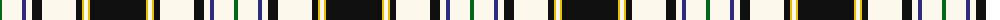

The parent of this is [Bro-Roazhon (Corporate)](/tartans/g/4/w20/db4/w6/k10/w34/k6/y2/w4/y2/k/56/)

This was sourced from tartans-authority.  It is a [11 stripes tartan](/stripes/stripes11/).

Original link http://www.tartansauthority.com/tartan-ferret/display/6652/

## Thread count
G/4 W20 DB4 W6 K10 W34 K6 Y2 W4 Y2 K/56

## Palette
Each colour and its ΔE from the base-6 reference it is a variant of.

| Colour | Shade | Base | ΔE (OKLab) |
|---|---|---|---|
| DB |  `#2C2C80` | B  | 0.05 |
| G |  `#006818` | G  | 0.02 |
| K |  `#101010` | K  | 0.17 |
| W |  `#FCF8EC` | W  | 0.02 |
| Y |  `#E8C000` | Y  | 0.00 |

ID: /variants/g/4/w20/db4/w6/k10/w34/k6/y2/w4/y2/k/56-db2c2c80-g006818-k101010-wfcf8ec-ye8c000/
