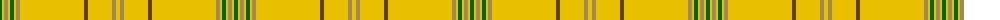

The parent of this is [Houston Family Tartan Tartan Number: 2290. Earliest known date: 1994 Nothing See products available Copyright © Blair Urquhart, Comrie, 2015](/tartans/g/4/y2/lt4/y2/g4/y2/lt4/y64/t4/y24/lt4/y/4/)

This was sourced from house-of-tartan.  It is a [12 stripes tartan](/stripes/stripes12/).

Original link http://www.house-of-tartan.scotland.net/house/TartanViewjs.asp?colr=Def&tnam=2290

## Thread count
G/4 Y2 LT4 Y2 G4 Y2 LT4 Y64 T4 Y24 LT4 Y/4

## Palette
Each colour and its ΔE from the base-6 reference it is a variant of.

| Colour | Shade | Base | ΔE (OKLab) |
|---|---|---|---|
| G |  `#006818` | G  | 0.02 |
| LT |  `#A08858` | Y  | 0.21 |
| T |  `#604000` | G  | 0.14 |
| Y |  `#E8C000` | Y  | 0.00 |

ID: /variants/g/4/y2/lt4/y2/g4/y2/lt4/y64/t4/y24/lt4/y/4-g006818-lta08858-t604000-ye8c000/
