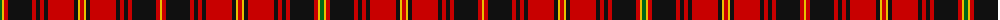

The parent of this is [Hallingdal](/tartans/g/4/y2/r4/k24/r4/k4/r4/k4/r26/k4/y2/r4/y2/k4/r26/k4/r4/k4/r4/k24/r4/y/2/)

This was sourced from register-of-tartans.  It is a [22 stripes tartan](/stripes/stripes22/).

Original link https://www.tartanregister.gov.uk/tartanDetails.aspx?ref=1574

## Thread count
G/4 Y2 R4 K24 R4 K4 R4 K4 R26 K4 Y2 R4 Y2 K4 R26 K4 R4 K4 R4 K24 R4 Y/2

## Palette
Each colour and its ΔE from the base-6 reference it is a variant of.

| Colour | Shade | Base | ΔE (OKLab) |
|---|---|---|---|
| G |  `#006818` | G  | 0.02 |
| K |  `#101010` | K  | 0.17 |
| R |  `#C80000` | R  | 0.00 |
| Y |  `#E8C000` | Y  | 0.00 |

ID: /variants/g/4/y2/r4/k24/r4/k4/r4/k4/r26/k4/y2/r4/y2/k4/r26/k4/r4/k4/r4/k24/r4/y/2-g006818-k101010-rc80000-ye8c000/
