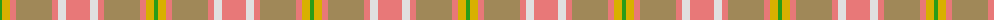

The parent of this is [Golden Pheasant](/tartans/g/4/y8/lr6/lt36/lr6/ln8/lr/24/)

This was sourced from register-of-tartans.  It is a [7 stripes tartan](/stripes/stripes7/).

Original link https://www.tartanregister.gov.uk/tartanDetails.aspx?ref=1446

## Thread count
G/4 Y8 LR6 LT36 LR6 LN8 LR/24

## Palette
Each colour and its ΔE from the base-6 reference it is a variant of.

| Colour | Shade | Base | ΔE (OKLab) |
|---|---|---|---|
| G |  `#289C18` | G  | 0.18 |
| LN |  `#E0E0E0` | W  | 0.06 |
| LR |  `#E87878` | R  | 0.19 |
| LT |  `#A08858` | Y  | 0.21 |
| N |  `#406054` | G  | 0.11 |
| Na |  `#A0A0A0` | Y  | 0.20 |
| T |  `#98481C` | R  | 0.11 |
| Y |  `#D8B000` | Y  | 0.05 |

# Sample pattern

ID: /variants/g/4/y8/lr6/lt36/lr6/ln8/lr/24-g289c18-lne0e0e0-lre87878-lta08858-n406054-naa0a0a0-t98481c-yd8b000/
