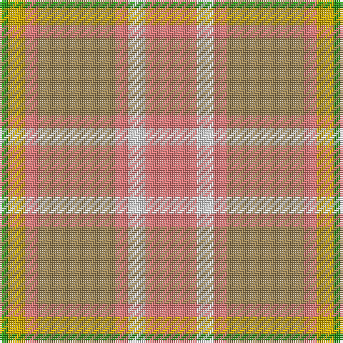

The parent of this is [Golden Pheasant (Fashion)](/tartans/g/4/y8/lr6/lt36/lr6/ln8/lr/24/)

This was sourced from tartans-authority.  It is a [7 stripes tartan](/stripes/stripes7/).

Original link http://www.tartansauthority.com/tartan-ferret/display/5052/

## Thread count
G/4 Y8 LR6 LT36 LR6 LN8 LR/24

## Palette
Each colour and its ΔE from the base-6 reference it is a variant of.

| Colour | Shade | Base | ΔE (OKLab) |
|---|---|---|---|
| G |  `#289C18` | G  | 0.18 |
| LN |  `#E0E0E0` | W  | 0.06 |
| LR |  `#E87878` | R  | 0.19 |
| LT |  `#A08858` | Y  | 0.21 |
| Y |  `#D8B000` | Y  | 0.05 |

# Sample pattern

ID: /variants/g/4/y8/lr6/lt36/lr6/ln8/lr/24-g289c18-lne0e0e0-lre87878-lta08858-yd8b000/
