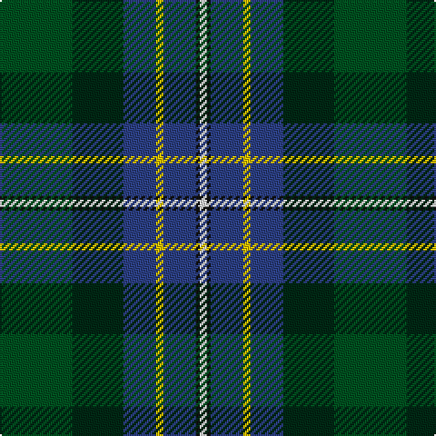

The parent of this is [Hughes](/tartans/g/40/dg28/b18/y4/b18/k2/ln/4/)

This was sourced from register-of-tartans.  It is a [7 stripes tartan](/stripes/stripes7/).

Original link https://www.tartanregister.gov.uk/tartanDetails.aspx?ref=1779

## Thread count
G/40 DG28 B18 Y4 B18 K2 LN/4

## Palette
Each colour and its ΔE from the base-6 reference it is a variant of.

| Colour | Shade | Base | ΔE (OKLab) |
|---|---|---|---|
| B |  `#2C4084` | B  | 0.00 |
| DG |  `#002814` | B  | 0.21 |
| G |  `#005020` | G  | 0.08 |
| K |  `#101010` | K  | 0.17 |
| LN |  `#E0E0E0` | W  | 0.06 |
| Y |  `#E8C000` | Y  | 0.00 |

# Sample pattern

ID: /variants/g/40/dg28/b18/y4/b18/k2/ln/4-b2c4084-dg002814-g005020-k101010-lne0e0e0-ye8c000/
