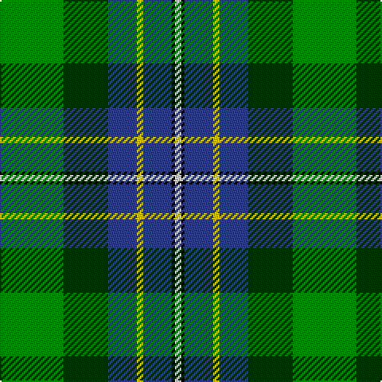

The parent of this is [Hughes](/tartans/g/40/dg28/b18/y4/b18/k2/ln/4/)

This was sourced from weddslist.  It is a [7 stripes tartan](/stripes/stripes7/).

Original link http://www.weddslist.com/cgi-bin/tartans/pg.pl?source=sts

## Thread count
G/40 DG28 B18 Y4 B18 K2 LN/4

## Palette
Each colour and its ΔE from the base-6 reference it is a variant of.

| Colour | Shade | Base | ΔE (OKLab) |
|---|---|---|---|
| B |  `#304080` | B  | 0.01 |
| DG |  `#003000` | G  | 0.18 |
| G |  `#008000` | G  | 0.09 |
| K |  `#000000` | K  | 0.00 |
| LN |  `#E0E0E0` | W  | 0.06 |
| Y |  `#F0C000` | Y  | 0.01 |

# Sample pattern

ID: /variants/g/40/dg28/b18/y4/b18/k2/ln/4-b304080-dg003000-g008000-k000000-lne0e0e0-yf0c000/
