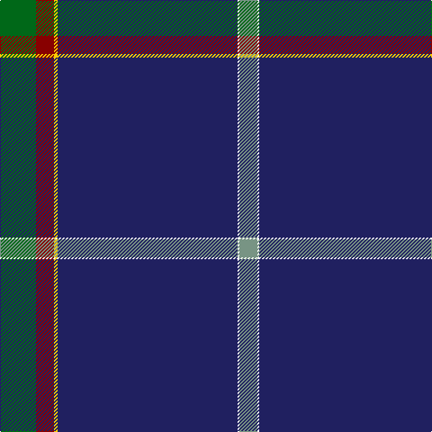

The parent of this is [Ravetta (Name)](/tartans/g/40/dr20/y4/db200/w2/lg/20/)

This was sourced from tartans-authority.  It is a [6 stripes tartan](/stripes/stripes6/).

Original link http://www.tartansauthority.com/tartan-ferret/display/10756/

## Thread count
G/40 DR20 Y4 DB200 W2 LG/20

## Palette
Each colour and its ΔE from the base-6 reference it is a variant of.

| Colour | Shade | Base | ΔE (OKLab) |
|---|---|---|---|
| DB |  `#202060` | B  | 0.11 |
| DR |  `#880000` | R  | 0.14 |
| G |  `#006818` | G  | 0.02 |
| LG |  `#789484` | G  | 0.23 |
| W |  `#FCFCFC` | W  | 0.03 |
| Y |  `#FCCC00` | Y  | 0.04 |

# Sample pattern

ID: /variants/g/40/dr20/y4/db200/w2/lg/20-db202060-dr880000-g006818-lg789484-wfcfcfc-yfccc00/
