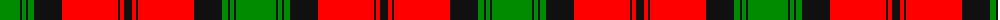

The parent of this is [Kerr](/tartans/g/40/k2/g4/k2/g6/k28/r56/k2/r4/k/8/)

This was sourced from register-of-tartans.  It is a [10 stripes tartan](/stripes/stripes10/).

Original link https://www.tartanregister.gov.uk/tartanDetails.aspx?ref=1954

## Thread count
G/40 K2 G4 K2 G6 K28 R56 K2 R4 K/8

## Palette
Each colour and its ΔE from the base-6 reference it is a variant of.

| Colour | Shade | Base | ΔE (OKLab) |
|---|---|---|---|
| G |  `#008B00` | G  | 0.12 |
| K |  `#101010` | K  | 0.17 |
| R |  `#FF0000` | R  | 0.11 |

ID: /variants/g/40/k2/g4/k2/g6/k28/r56/k2/r4/k/8-g008b00-k101010-rff0000/
