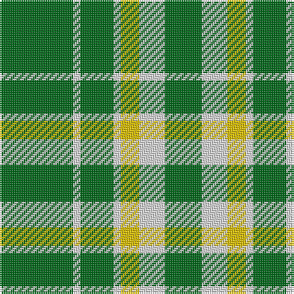

The parent of this is [Heritage (Commemorative)](/tartans/g/40/ln4/g18/ln4/y10/ln14/g/20/)

This was sourced from tartans-authority.  It is a [7 stripes tartan](/stripes/stripes7/).

Original link http://www.tartansauthority.com/tartan-ferret/display/8039/

## Thread count
G/40 LN4 G18 LN4 Y10 LN14 G/20

## Palette
Each colour and its ΔE from the base-6 reference it is a variant of.

| Colour | Shade | Base | ΔE (OKLab) |
|---|---|---|---|
| G |  `#006818` | G  | 0.02 |
| LN |  `#E0E0E0` | W  | 0.06 |
| Y |  `#E8C000` | Y  | 0.00 |

# Sample pattern

ID: /variants/g/40/ln4/g18/ln4/y10/ln14/g/20-g006818-lne0e0e0-ye8c000/
