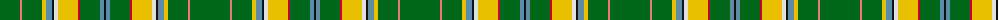

The parent of this is [City of Lethbridge (District)](/tartans/g/40/lr2/g20/y4/b6/k2/ln4/y20/r2/g20/b4/k/2/)

This was sourced from tartans-authority.  It is a [12 stripes tartan](/stripes/stripes12/).

Original link http://www.tartansauthority.com/tartan-ferret/display/2672/

## Thread count
G/40 LR2 G20 Y4 B6 K2 LN4 Y20 R2 G20 B4 K/2

## Palette
Each colour and its ΔE from the base-6 reference it is a variant of.

| Colour | Shade | Base | ΔE (OKLab) |
|---|---|---|---|
| B |  `#5C8CA8` | B  | 0.23 |
| G |  `#006818` | G  | 0.02 |
| K |  `#101010` | K  | 0.17 |
| LN |  `#E0E0E0` | W  | 0.06 |
| LR |  `#E87878` | R  | 0.19 |
| R |  `#C8002C` | R  | 0.03 |
| Y |  `#E8C000` | Y  | 0.00 |

ID: /variants/g/40/lr2/g20/y4/b6/k2/ln4/y20/r2/g20/b4/k/2-b5c8ca8-g006818-k101010-lne0e0e0-lre87878-rc8002c-ye8c000/
