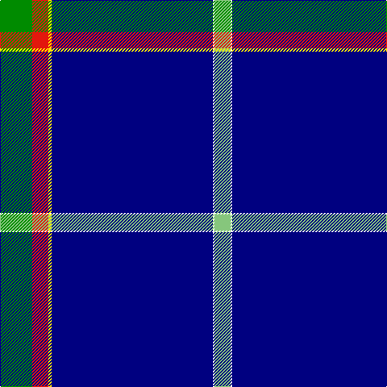

The parent of this is [Ravetta, Phil (Fife)](/tartans/g/40/r20/y4/db200/w2/lg/20/)

This was sourced from register-of-tartans.  It is a [6 stripes tartan](/stripes/stripes6/).

Original link https://www.tartanregister.gov.uk/tartanDetails.aspx?ref=10756

## Thread count
G/40 R20 Y4 DB200 W2 LG/20

## Palette
Each colour and its ΔE from the base-6 reference it is a variant of.

| Colour | Shade | Base | ΔE (OKLab) |
|---|---|---|---|
| DB |  `#000080` | B  | 0.14 |
| G |  `#008B00` | G  | 0.12 |
| LG |  `#86C67C` | Y  | 0.14 |
| R |  `#E3170D` | R  | 0.06 |
| W |  `#FFFFFF` | W  | 0.03 |
| Y |  `#FFE600` | Y  | 0.10 |

# Sample pattern

ID: /variants/g/40/r20/y4/db200/w2/lg/20-db000080-g008b00-lg86c67c-re3170d-wffffff-yffe600/
