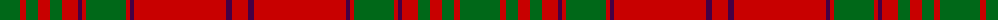

The parent of this is [MacAlister of Glenbarr (Clan)](/tartans/g/40/r6/g12/r12/g12/r16/dp4/r4/g40/r4/dp4/r92/dp6/r/16/)

This was sourced from tartans-authority.  It is a [14 stripes tartan](/stripes/stripes14/).

Original link http://www.tartansauthority.com/tartan-ferret/display/877/

## Thread count
G/40 R6 G12 R12 G12 R16 DP4 R4 G40 R4 DP4 R92 DP6 R/16

## Palette
Each colour and its ΔE from the base-6 reference it is a variant of.

| Colour | Shade | Base | ΔE (OKLab) |
|---|---|---|---|
| DP |  `#440044` | B  | 0.17 |
| G |  `#006818` | G  | 0.02 |
| R |  `#C80000` | R  | 0.00 |

ID: /variants/g/40/r6/g12/r12/g12/r16/dp4/r4/g40/r4/dp4/r92/dp6/r/16-dp440044-g006818-rc80000/
