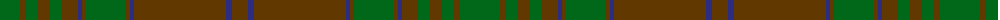

The parent of this is [MacAlister of Glenbarr Htg (Clan)](/tartans/g/40/t6/g12/t12/g12/t16/db4/t4/g40/t4/db4/t92/db6/t/16/)

This was sourced from tartans-authority.  It is a [14 stripes tartan](/stripes/stripes14/).

Original link http://www.tartansauthority.com/tartan-ferret/display/910/

## Thread count
G/40 T6 G12 T12 G12 T16 DB4 T4 G40 T4 DB4 T92 DB6 T/16

## Palette
Each colour and its ΔE from the base-6 reference it is a variant of.

| Colour | Shade | Base | ΔE (OKLab) |
|---|---|---|---|
| DB |  `#2C2C80` | B  | 0.05 |
| G |  `#006818` | G  | 0.02 |
| T |  `#603800` | G  | 0.16 |

ID: /variants/g/40/t6/g12/t12/g12/t16/db4/t4/g40/t4/db4/t92/db6/t/16-db2c2c80-g006818-t603800/
