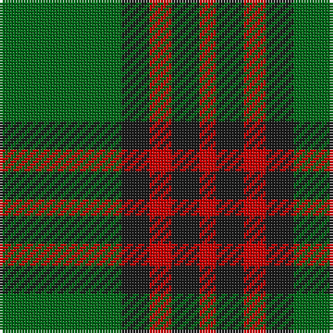

The parent of this is [Romsdal (District)](/tartans/g/44/k10/r8/k10/r/6/)

This was sourced from tartans-authority.  It is a [5 stripes tartan](/stripes/stripes5/).

Original link http://www.tartansauthority.com/tartan-ferret/display/2087/

## Thread count
G/44 K10 R8 K10 R/6

## Palette
Each colour and its ΔE from the base-6 reference it is a variant of.

| Colour | Shade | Base | ΔE (OKLab) |
|---|---|---|---|
| G |  `#006818` | G  | 0.02 |
| K |  `#1C1C1C` | B  | 0.20 |
| R |  `#C80000` | R  | 0.00 |

# Sample pattern

ID: /variants/g/44/k10/r8/k10/r/6-g006818-k1c1c1c-rc80000/
